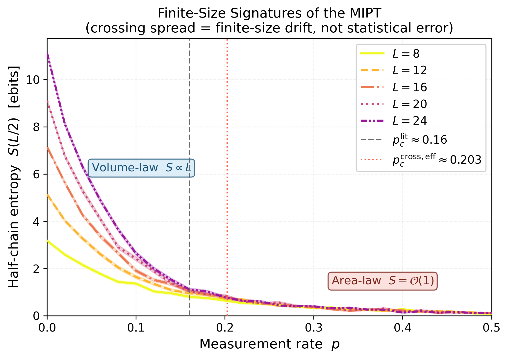

# Measurement-Induced Entanglement Phase Transitions in 1D Random Clifford Circuits

PHYS 130B Final Project — University of California San Diego  
Jacob Ortiz

---

Hybrid quantum circuits that interleave random unitary gates with projective
measurements exhibit a sharp entanglement phase transition: below a critical
measurement rate $p_c$, the system sits in a volume-law entangled phase
($S(L/2) \propto L$); above it, measurements dominate and entanglement collapses
to an area law ($S(L/2) = O(1)$). This transition — the measurement-induced phase
transition (MIPT) — is one of the more striking results in recent quantum dynamics
research, with structural connections to quantum error correction thresholds and
replica field theory.

This project implements the full simulation pipeline from scratch and reproduces
the qualitative phenomenology of the MIPT at system sizes $L \leq 24$.

## What was built from scratch

- **Aaronson-Gottesman stabilizer tableau** — full $(2n) \times (2n+1)$ binary
  matrix over GF(2), implementing H, S, CNOT, and projective measurement with
  exact rowsum phase tracking. No Stim, no Qiskit.
- **Entanglement entropy via GF(2) rank** — XOR Gaussian elimination on the
  stabilizer submatrix restricted to one half of the chain. No floating-point
  linear algebra.
- **Brickwork hybrid circuit** — alternating layers of random two-qubit Cliffords
  and single-site measurements at rate $p$. Single-qubit gates are sampled
  uniformly from the verified 24-element group (programmatically enumerated by
  Pauli action); the two-qubit ensemble is not verified uniform over all 11,520
  elements. Configurable warmup thermalization.
- **Disorder-averaged parameter sweep** — deterministic seeding via
  `numpy.SeedSequence`, checkpoint saving, and companion metadata JSON for
  full reproducibility.
- **Analysis pipeline** — adjacent-size crossing analysis with bootstrap
  uncertainty, FSS collapse with sensitivity analysis, multi-$p$ log-scaling
  table, and all four report figures.
- **LaTeX report** — 7-page write-up in RevTeX4-2 / PRL format with full
  theoretical background, appendices, and citations.

## Main result

The simulation reproduces the qualitative crossover from volume-law to area-law
entanglement and all expected finite-size signatures of the MIPT.

| Quantity | This project ($L \leq 24$) | Literature (thermodynamic) |
|---|---|---|
| $p_c^{\mathrm{eff}}$ (curve crossing) | $0.203 \pm 0.017$ | $\approx 0.16$ (Li et al. 2019) |
| $p_c^{\mathrm{eff}}$ (FSS collapse) | $0.209 \pm 0.008$ | $\approx 0.16$ (Li et al. 2019) |
| $\nu_{\mathrm{eff}}$ | $1.72 \pm 0.10$ | $\approx 1.28$ (Zabalo et al. 2020) |
| $\alpha_{\mathrm{eff}}$ at $p = 0.16$ | $0.27 \pm 0.07$ | $\approx 1.6$ (Li et al. 2019, $L \gg 100$) |
| $\alpha_{\mathrm{vol}}$ at $p = 0$ | $0.995 \pm 0.017$ | $\sim 1$ (volume-law) |

Reported $\pm$ values are bootstrap statistical uncertainties. The dominant source
of deviation from literature values is systematic finite-size bias, not
statistical noise — it cannot be reduced by collecting more samples at fixed $L$.



*Half-chain entropy vs. measurement rate for $L \in \{8,12,16,20,24\}$.
Shaded bands are $\pm 1$ SEM. The thermodynamic transition lies near $p \approx 0.16$
(dashed); the finite-size effective crossing is near $p \approx 0.20$ (dotted),
consistent with known finite-size bias at $L \lesssim 50$.*

## Main limitation

At $L \leq 24$, the system has not entered the asymptotic critical scaling regime
for any of the exponents studied. The extracted $p_c^{\mathrm{eff}}$,
$\nu_{\mathrm{eff}}$, and $\alpha_{\mathrm{eff}}$ are finite-size effective
estimates, not thermodynamic values. Precision MIPT studies use $L \sim 512$.
This project is best described as a from-scratch reproduction of the qualitative
phenomenology, not a precision numerical study.

## Running tests

From the repo root:

```bash
pip install -e ".[dev]"
python -m pytest -v
```

37 tests cover tableau initialization, gate conjugation (H, S, CNOT), Bell and
GHZ entanglement entropy, measurement collapse, symplectic pairing invariants,
GF(2) rank, and circuit-level volume-law / area-law behavior. All 37 pass.

## Reproducing results

All simulation commands run from `miet/`. See [`docs/reproduce_results.md`](docs/reproduce_results.md) for the complete walkthrough. Quick version:

```bash
cd miet/
python scripts/physics_audit.py        # 7 correctness checks
python scripts/run_sweep.py --seed 42  # ~2-3 hours, saves data/sweep_results.npz
python analysis/phase_diagram.py       # fig1 + crossing table
python analysis/finite_size.py         # fig3 + fss_config.json
python analysis/log_scaling.py         # fig2 + alpha table
```

The compiled report is at [`miet_research_report.pdf`](miet_research_report.pdf).

## Repository structure

```
miet-clifford/
  pyproject.toml          # installable package (pip install -e ".[dev]")
  miet/
    miet_clifford/
      stabilizer.py       # Aaronson-Gottesman tableau
      entropy.py          # GF(2) rank entropy
      circuit.py          # brickwork hybrid circuit
      simulation.py       # disorder averaging, sweep, checkpointing
    analysis/
      phase_diagram.py    # fig1 + crossing analysis
      log_scaling.py      # fig2 + alpha-vs-p table
      finite_size.py      # fig3 + sensitivity analysis
      critical_fit.py     # tabular summary
    scripts/
      run_quick.py        # L in {8,12}, fast sanity check
      run_sweep.py        # L in {8..24}, full sweep
      physics_audit.py    # 7 correctness checks
    tests/
      test_stabilizer.py       # 30 tableau + circuit tests
      test_reproducibility.py  # 7 seed/metadata tests
    data/                 # .npz results, crossing table, FSS config
    figures/              # generated PDF and PNG figures
    report/               # LaTeX source (RevTeX4-2 / PRL)
  docs/
    reproduce_results.md  # full reproduction walkthrough
  miet_research_report.pdf
```

## References

- Li, Chen, Fisher. PRB 98, 205136 (2018); PRB 100, 134306 (2019).
- Skinner, Ruhman, Nahum. PRX 9, 031009 (2019).
- Aaronson, Gottesman. PRA 70, 052328 (2004).
- Hamma, Ionicioiu, Zanardi. PLA 337, 22 (2005).
- Jian, You, Vasseur, Ludwig. PRB 101, 104302 (2020).
- Zabalo et al. PRB 101, 060301(R) (2020).
